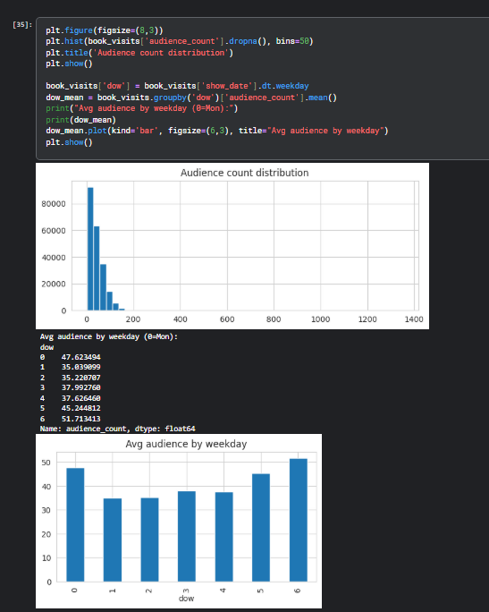
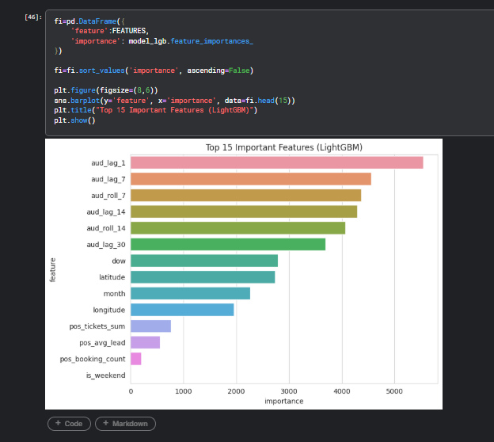

# 🎬 Cinema Audience Forecasting using Machine Learning

## 📌 Overview
This project predicts daily cinema audience count using historical booking trends, theatre metadata, and calendar-based information.

The objective was to understand audience behavior patterns and forecast future footfall using machine learning techniques.

---

## 📂 Dataset Information
The project combines multiple datasets including:

- Online booking data
- POS ticket sales data
- Theatre metadata
- Calendar information
- Audience visit records

---

## ⚙️ Project Workflow

### ✅ Data Preprocessing
- Missing value handling
- Datetime conversion
- Theatre mapping
- Data aggregation

### ✅ Exploratory Data Analysis (EDA)
- Audience distribution analysis
- Weekday vs weekend trends
- Footfall behavior analysis

### ✅ Feature Engineering
- Lag Features
- Rolling Mean Features
- Weekday/Weekend Features
- Lead Time Features
- Monthly Trend Features

### ✅ Models Used
- Ridge Regression
- LightGBM
- XGBoost

---

## 📊 Exploratory Data Analysis

The following plots show:
- Right-skewed audience distribution
- Higher audience count during weekends
- Audience behavior trends

---

## 📈 Feature Importance

LightGBM feature importance analysis showed that lag-based historical features contributed the most to prediction performance.

---

## 📉 Evaluation Metrics
The models were evaluated using:

- RMSE (Root Mean Squared Error)
- MAE (Mean Absolute Error)

XGBoost achieved the best performance among all models.

---

## 🛠️ Technologies Used

- Python
- Pandas
- NumPy
- Scikit-learn
- LightGBM
- XGBoost
- Matplotlib
- Seaborn

---

## 🚀 Key Learnings

Through this project, I gained practical experience in:
- Data preprocessing
- Feature engineering
- Time-series style forecasting
- Ensemble learning
- Model evaluation
- Kaggle-style machine learning workflow
